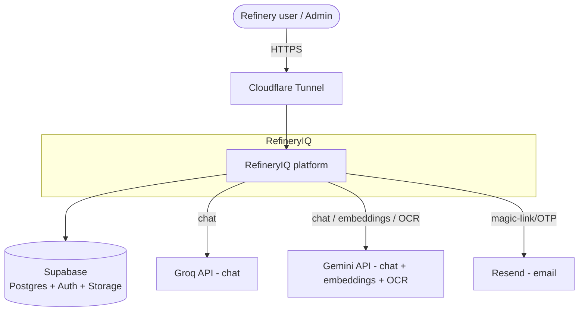
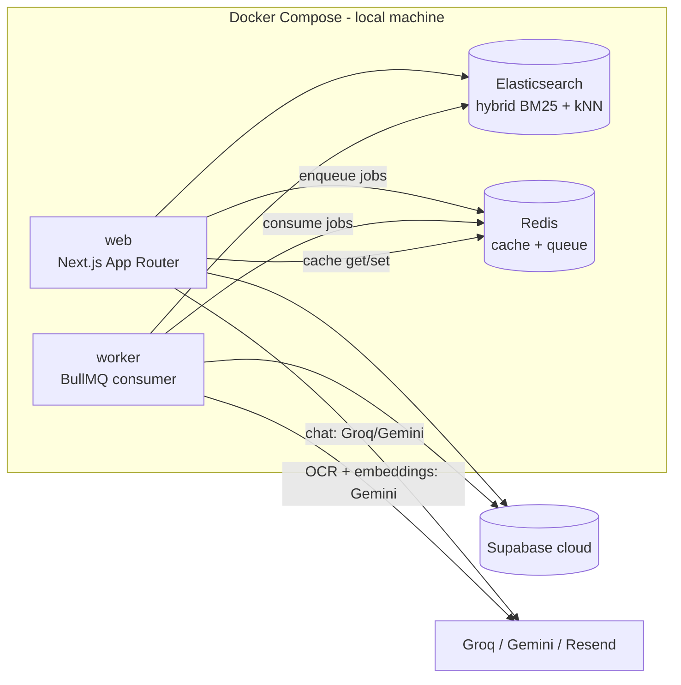
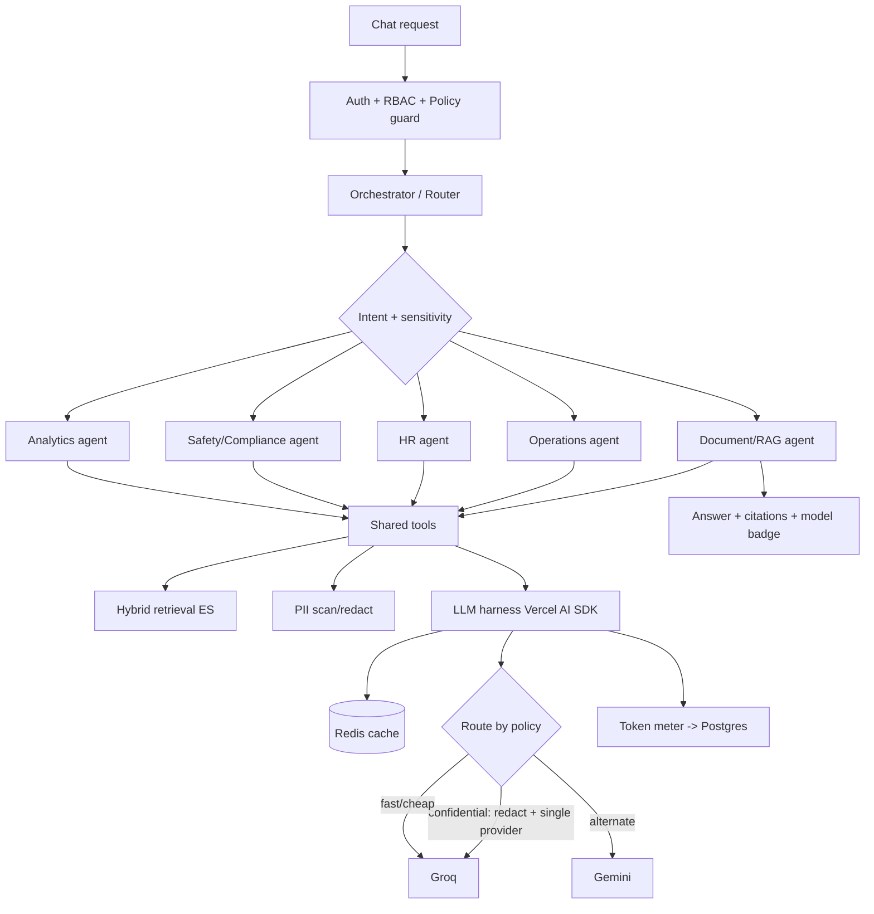
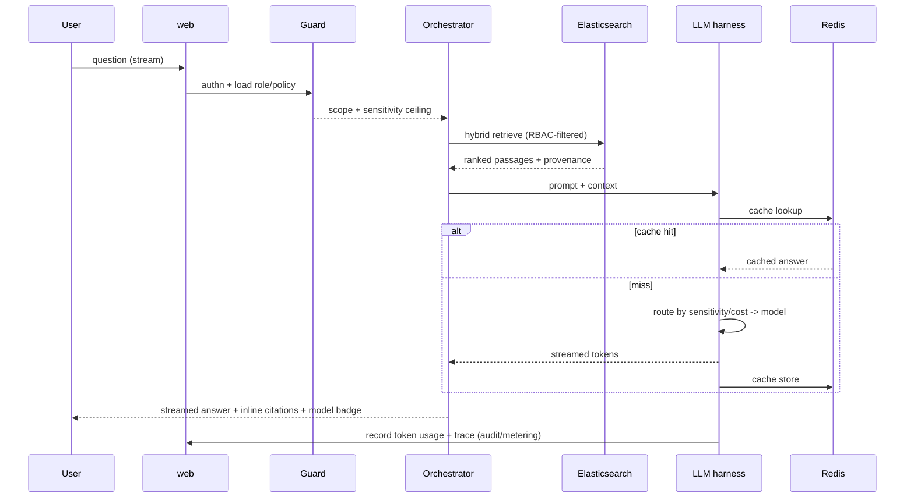
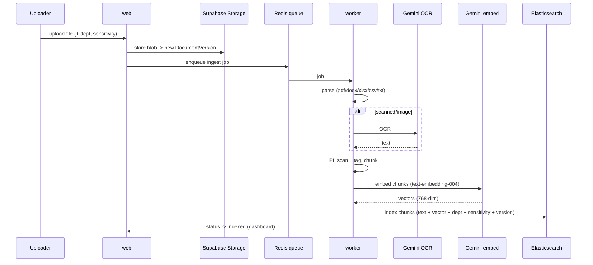
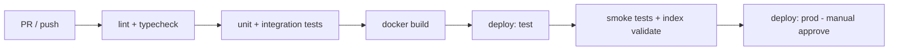

# 03 — Software Architecture

> **Status:** 🔒 Approved — Locked v1.1 (2026-06-04) · **Phase:** Architecture (SDLC step 4)
> **Builds on:** [00 — Brainstorm](00-brainstorm.md) · [01 — PRD](01-prd.md)
> Design (`02`) and Database (`04`) are produced alongside this; this doc is the source of truth for *how the system is built*.

---

## 1. Architectural principles

- **AI-first, server-authoritative.** The chat path is the spine; RBAC and LLM-policy are enforced **server-side** before any model call (NFR-SEC-1).
- **Sync UI, async heavy work.** The web tier responds fast; ingestion/OCR/embedding run on a **worker** off a Redis queue (NFR-SCALE-1).
- **Policy decides routing.** Sensitivity classification — not convenience — decides redaction strictness and which provider may be used (G3, FR-LLM-2).
- **Everything cited or nothing claimed.** RAG passages carry provenance end-to-end (FR-CHAT-2, FR-RAG-3).
- **Free/OSS, single box, one command.** Whole stack via `docker compose up` on the demo machine; Supabase is the only managed (cloud) dependency (NFR-REL-1, NFR-PORT-1).

---

## 2. System context (C4 L1)

External managed services (all free tier): Supabase, Groq, Gemini, Resend, Cloudflare. No Anthropic (ADR-0004). Everything else runs locally in Docker.

---

## 3. Container view (C4 L2)

| Container | Tech | Responsibility |
|---|---|---|
| **web** | Next.js (App Router) route handlers + server actions | Auth gate, chat orchestration, RAG query, RBAC, admin/dashboard APIs, UI |
| **worker** | Node + BullMQ | Ingestion pipeline: parse → OCR → PII → chunk → embed → index; re-index on version change |
| **elasticsearch** | Elasticsearch 8.x single-node | Document chunk index; hybrid retrieval |
| **redis** | Redis 7 | LLM response cache + BullMQ job queue + sessions/rate state |
| **supabase** *(cloud)* | Postgres + Auth + Storage | System-of-record, auth, file blobs + versions |

> No local LLM: chat uses Groq + Gemini APIs; embeddings + OCR use Gemini (ADR-0004). This removes the Ollama container (and ~2 GB RAM) and avoids slow CPU inference.

> Same Docker image runs `web` and `worker` (different entrypoint) — see `infra/Dockerfile` (architecture decision: one build, two roles).

---

## 4. Component view — the request brain

- **Guard** (FR-RBAC-1..4, FR-AGENT-2): resolves user → role → permitted departments; loads applicable `PolicyRule`s; computes a **sensitivity ceiling** for the request.
- **Orchestrator** (FR-AGENT-1): classifies intent + sensitivity, selects agent(s), assembles the final cited answer; refuses gracefully when no permitted sources exist (FR-CHAT-6).
- **Shared tools** (FR-AGENT-3): retrieval, PII, sentiment, and the token-metered LLM harness — every agent uses the same primitives.

---

## 5. Key flows

### 5.1 Chat query (happy path)

### 5.2 Document ingestion (async)

### 5.3 Continuously-current index ("Active CI/CD RAG", FR-VER-4)
A new/updated `DocumentVersion` (re-upload, or "set current") **automatically enqueues** re-ingestion; old-version chunks are superseded so retrieval defaults to the current version. A CI job can additionally rebuild/validate the index from source-of-truth on demand.

### 5.4 Sensitivity routing (G3, FR-LLM-2/3, FR-PII-2/3)
All chat is via 3rd-party APIs (no local model), so sensitivity drives **redaction strictness** and **provider trust**, not local-vs-cloud.
1. Guard sets a sensitivity level (e.g., `public`/`internal`/`confidential`).
2. PII is redacted before **every** egress; redaction strictness scales with sensitivity (FR-PII-2).
3. Provider selection: `confidential` → **single designated provider only** (default Groq), no cross-provider fallback; `internal`/`public` → cost/latency routing across Groq (primary) and Gemini (alternate).
4. The chosen model + routing reason are badged in the UI and written to the audit log.

---

## 6. Multi-LLM harness & routing

- **One interface** via **Vercel AI SDK** providers: `anthropic`, `groq` for chat (+ `gemini` for OCR/vision **and** embeddings). OpenAI is a documented, unconfigured fallback.
- **Routing inputs:** sensitivity (hard constraint on provider) → task type → cost/latency budget → provider health.
- **Fallback chain** (FR-LLM-3): provider error/limit → next provider **allowed by policy**. Never use a provider disallowed by the sensitivity level.
- **Token metering** wraps every call (FR-TOK-1): model, input/output tokens, latency, cache hit/miss, estimated cost → `TokenUsage`.
- **Admin-tunable** routing rules and default models (FR-LLM-4, FR-ADMIN-3).

---

## 7. RAG design

- **Chunking:** structure-aware (headings/pages), ~500–800 tokens with overlap; each chunk keeps `doc_id`, `version_id`, location (page/section), `department`, `sensitivity`, `pii_flags`.
- **Embeddings:** Gemini `text-embedding-004` (free tier, 768-dim) → dense vectors stored in ES `dense_vector`.
- **Hybrid retrieval (FR-RAG-1):** BM25 query **+** kNN vector query, fused (RRF/weighted) into one ranked set.
- **RBAC filter (FR-RAG-2):** ES query always includes a `department ∈ permitted` + sensitivity filter **before** ranking.
- **Citations (FR-RAG-3):** retrieved chunks carry provenance; the answer cites doc + version + location; UI links resolve to the source.
- **No-source guard (FR-CHAT-6):** empty permitted result → explicit "no sources" response, no fabrication.

---

## 8. Caching & token optimization

- **Response cache (FR-CACHE-1):** Redis key = hash(normalized prompt + context fingerprint + model + policy scope). Hits skip the model entirely. Scoped per access-level to avoid leaking across roles.
- **Context optimization (FR-OPT-1):** trim/compact retrieved context to the top fused passages; cap tokens per hosted call.
- **Cost control (NFR-COST-1):** routing prefers Groq (free) for cheap tasks; caching + budgets keep usage within the Groq/Gemini free tiers.

---

## 9. Security architecture

- **AuthN:** Supabase Auth (email magic-link/OTP via Resend). Sessions verified on every request (FR-AUTH-1/3).
- **AuthZ:** RBAC enforced **server-side** in the Guard for every route, retrieval, and admin action (NFR-SEC-1, FR-RBAC-3). Postgres **Row-Level Security** as defense-in-depth on Supabase tables.
- **Secrets (NFR-SEC-2):** `.env` per environment, never committed; CI uses GitHub Actions secrets.
- **Env isolation (NFR-SEC-3):** separate Supabase projects/keys + ES indices + buckets per environment.
- **PII (FR-PII-*, NFR-PRIV-1):** detect+tag on ingest; redact before **every** API egress; policy can restrict high-sensitivity content to the primary trusted provider.
- **Audit (FR-LOG-3):** auth events, doc/version changes, admin/policy changes, and every policy-driven refusal/redaction recorded immutably-style in Postgres.

---

## 10. Logging & observability

- **App logs:** structured JSON (pino) across web + worker, correlation-id per request (FR-LOG-1).
- **LLM/agent traces:** agent chosen, model, tokens, cache hit/miss, citations used, routing reason (FR-LOG-2).
- **Metrics:** token/cost aggregates queryable for the dashboard (FR-TOK-2, FR-DASH-1); ingestion job status.
- Demo-scale: in-DB + log files; OpenTelemetry-ready structure for future export.

---

## 11. Infrastructure & environments

**Topology:** all containers in one Compose project on the demo box; Supabase managed in the cloud; **Cloudflare Tunnel** publishes `web` on a public URL. (Detailed in `infra/docker-compose.yml`, Brainstorm §7.)

| Concern | local | test | prod |
|---|---|---|---|
| Supabase | local project | test project | prod project |
| ES / Redis | Compose | Compose | Compose (resource-limited) |
| ES security | disabled | enabled | enabled |
| Secrets | `.env` | CI secrets | CI secrets |
| Public URL | localhost | Tunnel (test) | Tunnel (prod) |
| Data | synthetic | synthetic | synthetic (demo) |

`docker-compose.yml` (base) + `docker-compose.prod.yml` (overlay: security on, resource limits, no published DB ports).

---

## 12. CI/CD (GitHub Actions)

- **CI on PR:** lint, typecheck, tests, build (NFR-REL-1, success metric "green on main").
- **CD:** auto-deploy to **test**; **prod** behind manual approval. A scheduled/triggered **index-validate** job supports the continuously-current RAG (§5.3).
- Bug tracking: in-app widget feeds the product backlog (FR-BUG-*); **GitHub Issues** tracks our own dev defects/SDLC.

---

## 13. Tech stack (with versions)

| Layer | Choice | Version (target) |
|---|---|---|
| Runtime | Node.js | 22 LTS |
| App framework | Next.js (App Router) | 16.x (ADR-0005) |
| LLM harness | Vercel AI SDK | latest |
| Queue | BullMQ | latest |
| Chat LLM | Groq (Llama 3.3 70B) · Gemini | — |
| Embeddings + OCR | Gemini · `text-embedding-004` (768-dim) + vision | — |
| RDBMS/Auth/Storage | Supabase (Postgres 15) | cloud |
| Search/vectors | Elasticsearch | 8.15 |
| Cache/queue store | Redis | 7 |
| Email | Resend | — |
| Containers | Docker Compose | v2 |
| Edge/public | Cloudflare Tunnel | — |
| CI/CD | GitHub Actions | — |
| Logging | pino | latest |

---

## 14. Cross-cutting concerns

- **Errors/retries:** ingestion jobs retry with backoff; failures surface in dashboard (NFR-REL-1, FR-DOC-6).
- **Idempotency:** ingestion keyed by `version_id` so retries don't duplicate chunks.
- **Scalability (NFR-SCALE-1):** stateless web tier (scale horizontally), worker concurrency tunable, ES/Redis independently sized; for the demo, single instances.
- **Backpressure:** queue smooths upload bursts; rate state in Redis protects hosted-API quotas.

---

## 15. Open items / ADRs to record

1. **Hybrid fusion method** — RRF vs weighted sum (decide in build; default RRF).
2. **PII engine** — LLM-based vs a Presidio sidecar (start LLM-based; sidecar if precision needed).
3. **Sensitivity taxonomy** — `public/internal/confidential` pending company **LLM policy rules** (→ `llm-governance.md`).
4. **Sentiment model** — Groq vs Gemini; default Groq for cost.
5. **Conversation memory depth** — per-thread window; long-term memory out of MVP scope.

ADRs will live in `docs/adr/` as these are decided.

---

## 16. Requirement traceability (selected)

| Requirement | Realized by |
|---|---|
| FR-RBAC-* | §4 Guard, §7 RBAC filter, §9 RLS |
| FR-CHAT-* / FR-RAG-* | §5.1, §7 |
| FR-DOC-* / OCR | §5.2 worker, Gemini |
| FR-VER-* / "Active CI/CD RAG" | §5.3, §12 index-validate |
| FR-LLM-* / FR-TOK-* / FR-CACHE-* | §6, §8 |
| FR-PII-* / NFR-PRIV-1 | §5.4, §9 |
| FR-SENT-* | §4 tools, §15 |
| FR-DASH-* / FR-ADMIN-* | §10 metrics, §4 |
| FR-BUG-* | §12 (built-in widget) |
| NFR-SEC/SCALE/REL/COST | §9, §11, §12, §14 |

Next: **`04-database.md`** — Postgres schema + ERD, Elasticsearch index mappings, Redis key design, and DB conventions/rules.
