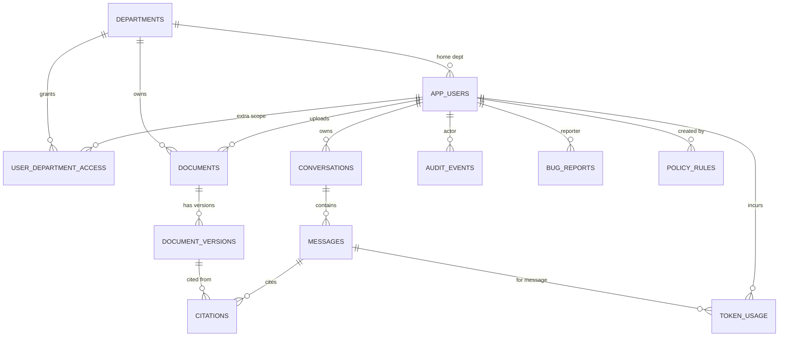

# 04 — Database Design (multi-DB)

> **Status:** Draft for review · **Phase:** Data design (SDLC step 5) · **Last updated:** 2026-06-04
> **Builds on:** [01 — PRD](01-prd.md) · [03 — Architecture](03-architecture.md)

Three datastores, each with a clear job (PRD FR-DB / Architecture §3):

| Store | Role | Holds |
|---|---|---|
| **Supabase Postgres** | System-of-record | users, roles, departments, documents + versions, conversations, citations, token usage, audit, bug reports, policy rules |
| **Elasticsearch** | Search / RAG | document **chunks** (text + dense vector + scope labels) |
| **Redis** | Cache / queue | LLM response cache, BullMQ ingestion queue, sessions/rate state |

Files (blobs) live in **Supabase Storage**, referenced by `document_versions.storage_path`.

---

## 1. Database rules & conventions

1. **IDs:** `uuid` primary keys (`gen_random_uuid()`), except Supabase-managed `auth.users.id`.
2. **Naming:** `snake_case`; tables plural, columns singular; FKs `<entity>_id`.
3. **Timestamps:** every table has `created_at timestamptz default now()`; mutable tables add `updated_at` (trigger-maintained).
4. **Soft delete** where history matters: `deleted_at timestamptz null` (documents, users). Hard delete only for transient data.
5. **Enums** are Postgres `enum` types (below) — not free text.
6. **Money/tokens:** token counts `integer`; cost `numeric(12,6)` USD.
7. **Scope columns:** any row that can be retrieved by chat carries `department` + `sensitivity`.
8. **Migrations:** versioned SQL in `supabase/migrations/`, forward-only, reviewed in PRs. No manual prod edits (NFR-SEC-3).
9. **RLS ON** for every table holding scoped data; service-role used only by the server (Architecture §9).
10. **Indexes:** add for every FK and every column used in a scope/filter (`department`, `sensitivity`, `status`, `created_at`).

### Enum types
```sql
create type role_t        as enum ('operator','engineer','safety_officer','hr_manager','plant_manager','admin');
create type department_t  as enum ('operations','maintenance','safety','hr','management','platform');
create type sensitivity_t as enum ('public','internal','confidential');   -- final taxonomy pending LLM policy rules
create type doc_status_t  as enum ('queued','processing','indexed','failed');
create type msg_role_t    as enum ('user','assistant','system','tool');
create type bug_status_t  as enum ('new','triaged','in_progress','closed');
create type model_t       as enum ('anthropic','groq','gemini');   -- gemini = embeddings/OCR; no local LLM
```

---

## 2. ERD (Postgres)



---

## 3. Postgres schema (DDL sketch)

> `app_users` extends Supabase `auth.users` (1:1) rather than duplicating auth.

```sql
-- Departments
create table departments (
  id          uuid primary key default gen_random_uuid(),
  key         department_t unique not null,
  name        text not null,
  created_at  timestamptz not null default now()
);

-- App users (profile + role), 1:1 with auth.users
create table app_users (
  id            uuid primary key references auth.users(id) on delete cascade,
  email         text not null,
  full_name     text,
  role          role_t not null default 'operator',
  home_dept     department_t not null,
  is_active     boolean not null default true,
  created_at    timestamptz not null default now(),
  updated_at    timestamptz not null default now(),
  deleted_at    timestamptz
);

-- Extra cross-department read grants (managers/admin get all via role logic)
create table user_department_access (
  user_id     uuid references app_users(id) on delete cascade,
  department  department_t not null,
  primary key (user_id, department)
);

-- Documents (logical) + versions (physical files)
create table documents (
  id           uuid primary key default gen_random_uuid(),
  title        text not null,
  department   department_t not null,
  sensitivity  sensitivity_t not null default 'internal',
  uploaded_by  uuid references app_users(id),
  current_version_id uuid,                       -- FK set after first version
  created_at   timestamptz not null default now(),
  updated_at   timestamptz not null default now(),
  deleted_at   timestamptz
);

create table document_versions (
  id            uuid primary key default gen_random_uuid(),
  document_id   uuid not null references documents(id) on delete cascade,
  version_no    integer not null,
  storage_path  text not null,                   -- Supabase Storage object
  mime_type     text not null,
  byte_size     bigint,
  ocr_used      boolean not null default false,
  pii_flags     jsonb not null default '[]',     -- detected PII types
  status        doc_status_t not null default 'queued',
  notes         text,
  created_by    uuid references app_users(id),
  created_at    timestamptz not null default now(),
  unique (document_id, version_no)
);
alter table documents
  add constraint fk_current_version
  foreign key (current_version_id) references document_versions(id);

-- Conversations & messages
create table conversations (
  id          uuid primary key default gen_random_uuid(),
  user_id     uuid not null references app_users(id) on delete cascade,
  title       text,
  created_at  timestamptz not null default now(),
  updated_at  timestamptz not null default now()
);

create table messages (
  id              uuid primary key default gen_random_uuid(),
  conversation_id uuid not null references conversations(id) on delete cascade,
  role            msg_role_t not null,
  content         text not null,
  agent           text,                          -- which specialist agent
  model           model_t,                       -- which model answered
  routing_reason  text,                          -- e.g. 'confidential -> redacted, anthropic-only'
  cache_hit       boolean,
  sentiment       numeric(4,3),                  -- optional, -1..1
  created_at      timestamptz not null default now()
);

-- Citations: link an assistant message to the source passage/version
create table citations (
  id            uuid primary key default gen_random_uuid(),
  message_id    uuid not null references messages(id) on delete cascade,
  version_id    uuid not null references document_versions(id),
  chunk_id      text not null,                   -- ES chunk _id
  location      text,                            -- page/section
  snippet       text,
  rank          integer,
  created_at    timestamptz not null default now()
);

-- Token usage / cost metering (one row per model call)
create table token_usage (
  id             uuid primary key default gen_random_uuid(),
  user_id        uuid references app_users(id),
  message_id     uuid references messages(id),
  department     department_t,
  model          model_t not null,
  input_tokens   integer not null default 0,
  output_tokens  integer not null default 0,
  latency_ms     integer,
  cache_hit      boolean not null default false,
  est_cost_usd   numeric(12,6) not null default 0,
  created_at     timestamptz not null default now()
);

-- Audit log (security-relevant events; append-only by convention)
create table audit_events (
  id          uuid primary key default gen_random_uuid(),
  actor_id    uuid references app_users(id),
  action      text not null,                     -- 'login','doc.version.create','policy.update','llm.redacted',...
  target_type text,
  target_id   text,
  metadata    jsonb not null default '{}',
  created_at  timestamptz not null default now()
);

-- In-app bug reports (FR-BUG-*)
create table bug_reports (
  id           uuid primary key default gen_random_uuid(),
  reporter_id  uuid references app_users(id),
  title        text not null,
  description  text not null,
  context      jsonb not null default '{}',      -- route, role, recent action
  screenshot_path text,
  sentiment    numeric(4,3),
  status       bug_status_t not null default 'new',
  created_at   timestamptz not null default now(),
  updated_at   timestamptz not null default now()
);

-- LLM policy rules (drives routing/refusal/PII; seeded from llm-governance.md)
create table policy_rules (
  id            uuid primary key default gen_random_uuid(),
  name          text not null,
  rule_type     text not null,                   -- 'routing'|'pii'|'refusal'|'access'|'audit'
  applies_to    jsonb not null default '{}',     -- {departments, roles, sensitivity}
  config        jsonb not null default '{}',     -- e.g. {redact:['email','phone'], providers:['anthropic']}
  enabled       boolean not null default true,
  created_by    uuid references app_users(id),
  created_at    timestamptz not null default now(),
  updated_at    timestamptz not null default now()
);
```

### Suggested indexes
```sql
create index on documents (department, sensitivity) where deleted_at is null;
create index on document_versions (document_id, status);
create index on messages (conversation_id, created_at);
create index on token_usage (department, created_at);
create index on token_usage (user_id, created_at);
create index on audit_events (actor_id, created_at);
create index on bug_reports (status, created_at);
```

---

## 4. Row-Level Security (defense-in-depth)

Server enforces RBAC in the Guard (Architecture §4/§9); RLS is the backstop.

```sql
-- example: documents readable only within the user's permitted departments
alter table documents enable row level security;

create policy doc_read on documents for select using (
  deleted_at is null and (
    -- admins & managers see all
    exists (select 1 from app_users u where u.id = auth.uid()
            and u.role in ('admin','plant_manager'))
    -- home department
    or department = (select home_dept from app_users where id = auth.uid())
    -- explicit extra grants
    or department in (select department from user_department_access where user_id = auth.uid())
  )
);
```
Analogous read policies on `document_versions`, `conversations` (owner-only), `messages`, `citations`. Write/admin tables (`policy_rules`, role changes) restricted to `admin`.

---

## 5. Elasticsearch — chunk index

One index `chunks` (per environment: `chunks_local`, `chunks_test`, `chunks_prod`). Embedding model **Gemini `text-embedding-004`** → **768 dims** (no local embeddings).

```jsonc
PUT /chunks
{
  "mappings": {
    "properties": {
      "doc_id":      { "type": "keyword" },
      "version_id":  { "type": "keyword" },
      "version_no":  { "type": "integer" },
      "is_current":  { "type": "boolean" },        // retrieval defaults to current
      "department":  { "type": "keyword" },        // RBAC filter
      "sensitivity": { "type": "keyword" },         // routing/filter
      "pii_flags":   { "type": "keyword" },
      "title":       { "type": "text" },
      "location":    { "type": "keyword" },         // page/section
      "text":        { "type": "text", "analyzer": "english" },  // BM25
      "embedding":   { "type": "dense_vector", "dims": 768,
                       "index": true, "similarity": "cosine" },   // kNN
      "created_at":  { "type": "date" }
    }
  }
}
```

**Hybrid query (FR-RAG-1/2):** a `bool` filter on `department ∈ permitted` + `is_current = true` (+ sensitivity), combined with BM25 `match` on `text` and a `knn` clause on `embedding`, fused via **RRF** (ADR pending, Architecture §15). RBAC filter is applied **before** ranking so disallowed chunks never surface.

**Currency:** on a new current version, prior chunks for that `doc_id` are deleted/flagged `is_current=false` and the new version's chunks indexed (FR-VER-4).

---

## 6. Redis — keys & namespaces

| Purpose | Key pattern | Notes |
|---|---|---|
| LLM response cache | `cache:llm:{scope_hash}:{prompt_ctx_model_hash}` | TTL (e.g. 1h); `scope_hash` includes access level so cache never crosses roles (FR-CACHE-1) |
| Ingestion queue | `bull:ingest:*` | BullMQ-managed |
| Rate/quota state | `rate:{provider}:{window}` | protects hosted-API free tiers |
| Session/aux | `sess:{user_id}` | short-lived, supplements Supabase session |

---

## 7. Environment separation

Per Architecture §11: distinct Supabase **projects** (own Postgres + Storage + keys), distinct ES indices (`chunks_{env}`), distinct Redis logical DBs/prefixes per `local|test|prod`. No shared data across environments (NFR-SEC-3).

---

## 8. Data lifecycle & retention (demo)

- Documents/versions: soft-deleted; versions retained for history (FR-VER-1).
- Conversations/messages: retained per user; deletable by owner/admin.
- `token_usage`, `audit_events`: retained for the demo (no purge); audit is append-only by convention.
- Synthetic data only (PRD §8) — no real PII; PII tooling is exercised against fabricated data.

---

## 9. Seed data

- 6 `departments`, one seeded `admin` user, a handful of users per role.
- Synthetic corpus loaded via an ingestion seeding script (parse → OCR → embed → index), producing `documents` + `document_versions` + ES `chunks`.
- Baseline `policy_rules` (e.g., `confidential → anthropic-only`, `redact email/phone before any API call`) — refined once company **LLM policy rules** arrive (`llm-governance.md`).

---

## 10. Traceability

| Requirement | Schema element |
|---|---|
| FR-RBAC-* | `app_users.role/home_dept`, `user_department_access`, RLS (§4), ES `department` filter |
| FR-DOC-* / FR-VER-* | `documents`, `document_versions`, `is_current` (ES) |
| FR-RAG-* / FR-CHAT-2 | ES `chunks` (§5), `citations` |
| FR-LLM-* / FR-TOK-* / FR-CACHE-* | `messages.model/routing_reason/cache_hit`, `token_usage`, Redis (§6) |
| FR-PII-* | `document_versions.pii_flags`, `policy_rules` |
| FR-SENT-* | `messages.sentiment`, `bug_reports.sentiment` |
| FR-LOG-3 / audit | `audit_events` |
| FR-BUG-* | `bug_reports` |
| FR-ADMIN-3 / FR-LLM-4 | `policy_rules` |

Next: with PRD + architecture + database drafted, remaining SDLC docs are **`02-design.md`** (UX/UI + design system) and **`llm-governance.md`** (pending your policy rules), then repo scaffolding (Compose, CI/CD).
